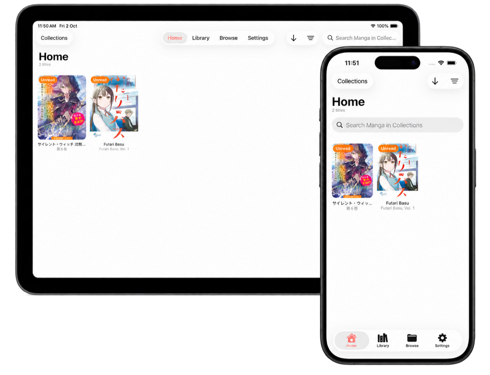

> [!IMPORTANT]
> Mankai does not provide, host, or distribute any media content. Users are responsible for obtaining media through legal means and complying with their local laws. Any plugins used with the app are unaffiliated with Mankai, and we have no control over them.

> [!WARNING]
> Mankai is pre-1.0.0, and breaking changes may be introduced before the 1.0.0 release. See the [roadmap](#road-to-100) for planned milestones.

<div align="center">

<a href="https://mankai.app">
  
</a>

# Mankai

**An extensible manga reader and library manager for iOS, iPadOS, and macOS.**

[](LICENSE)
[](https://github.com/mankai-app/mankai/tags)
[](https://www.apple.com/ios/)
[](https://developer.apple.com/mac-catalyst/)

[**Website**](https://mankai.app) · [**Install**](https://mankai.app/guides/installation/) · [**Quick start**](https://mankai.app/guides/quick-start/) · [**API reference**](https://mankai.app/api/overview/)

</div>

Built with SwiftUI and UIKit, Mankai brings local books, network libraries, and plugin sources together with collections, offline downloads, and optional sync across devices.

<p align="center">
  <a href="https://mankai.app/screenshots/">
    
  </a>
</p>

[View all screenshots](https://mankai.app/screenshots/)

## Features

- **Flexible sources** — JavaScript, file system, and HTTP plugins, plus OPDS, SMB, SFTP, NFS, and WebDAV shares.
- **Local books** — Read MMA, CBZ, CBR, EPUB, and PDF files from your device or connected shares.
- **Reader controls** — Paged and continuous layouts, horizontal and vertical navigation, and page-curl transitions.
- **Image processing** — [Automatic spread grouping](#smart-grouping), optional [on-device 4× AI upscaling](#real-esrgan-upscaling), and configurable remote image processors.
- **Collections and downloads** — Bookmark titles, track reading history, and download chapters for offline reading.
- **Optional sync** — Keep your collection, reading progress, URL-backed plugins, and remote share settings in sync through an HTTP server or Supabase.

## Road to 1.0.0

### App Features

- [x] **Plugin Installation Deep Links** - Review and add one or more plugins through a deep link.
- [x] **Export** - Export downloaded chapters as MMA archives or separate PDF files for each chapter and share them.
- [ ] ~~**Sharing** - Share manga as an image.~~
- [x] **Page curl animations** - Choose realistic page-turning animations in the paged reader for a more immersive reading experience.
- [ ] ~~**NavigationTransition (Hero Animation)** - Add smooth hero animations between related views.~~

### Sync Engines

- [ ] **iCloud** - Pending availability of resources (aka. I have no money)

### Integrations

- [ ] ~~**Komga** - Support for the Komga API.~~
- [x] **OPDS 1.2** - Open Publication Distribution System catalog support.
- [x] **SMB** - Server Message Block support.
- [x] **WebDAV** - Web Distributed Authoring and Versioning support.
- [x] **NFS** - Network File System support.
- [ ] ~~**FTP** - File Transfer Protocol support.~~
- [x] **SFTP** - SSH File Transfer Protocol support.

### Parsers

- [x] **EPUB** - Digital book format.
- [x] **PDF** - Portable Document Format.
- [x] **CBR** - Comic Book RAR archive.
- [x] **Mankai Custom Format** - ZIP archives with manga metadata and chapter images.

### AI Features

- [x] **AI Upscaling** - Enhance low-resolution pages for a sharper reading experience.
- [ ] ~~**Smart Dark Mode** - Transform page images into dark-friendly versions with AI while preserving readable line art, contrast, and important details.~~

## Documentation

For setup instructions, usage guides, and troubleshooting, visit the [Mankai documentation](https://mankai.app).

| Guide                                                             | What you will find                                                     |
| :---------------------------------------------------------------- | :--------------------------------------------------------------------- |
| [Installation](https://mankai.app/guides/installation/)           | Installation options for your device.                                  |
| [Quick start](https://mankai.app/guides/quick-start/)             | Add a source, read your first book, and save your place.               |
| [Add books and sources](https://mankai.app/guides/sources/)       | Set up plugins, import books, and connect local or network shares.     |
| [Collections and downloads](https://mankai.app/guides/library/)   | Manage saved titles, reading history, and offline chapters.            |
| [Reading and reader settings](https://mankai.app/guides/reading/) | Reading layouts, navigation, and reader controls.                      |
| [Image processing](https://mankai.app/guides/image-processing/)   | Configure upscaling, downsampling, page colors, and remote processors. |
| [Sync across devices](https://mankai.app/guides/sync/)            | Configure syncing for your collection and reading progress.            |
| [Troubleshooting](https://mankai.app/guides/troubleshooting/)     | Resolve common setup and reading issues.                               |

## Plugins and APIs

Build a content source or connect a service using the [API reference](https://mankai.app/api/overview/).

| Reference                                                        | Build                                                                    |
| :--------------------------------------------------------------- | :----------------------------------------------------------------------- |
| [JavaScript plugins](https://mankai.app/api/javascript-plugins/) | A content plugin with browsing, search, chapters, and images.            |
| [HTTP plugin API](https://mankai.app/api/http-api/)              | A server that serves a manga library to Mankai.                          |
| [Editor API](https://mankai.app/api/editor-api/)                 | Editing support for an HTTP source.                                      |
| [Image processor API](https://mankai.app/api/image-processors/)  | A configurable service that processes reader images.                     |
| [MMA format](https://mankai.app/api/mma-format/)                 | A ZIP archive containing book metadata, chapter groups, and page images. |

## Models and Benchmarks

### Real-ESRGAN Upscaling

Mankai can optionally upscale low-resolution reader images to four times their original pixel dimensions with the `realesr-animevideov3` model.

- **Core ML Conversion**: [Real-ESRGAN-CoreML](https://github.com/nohackjustnoobb/Real-ESRGAN-CoreML)
- **Original Model**: [`realesr-animevideov3`](https://github.com/xinntao/Real-ESRGAN/blob/master/docs/anime_video_model.md) from [Real-ESRGAN](https://github.com/xinntao/Real-ESRGAN), licensed under the [BSD 3-Clause License](https://github.com/xinntao/Real-ESRGAN/blob/master/LICENSE)

#### Performance

Core ML Performance Report medians on an **iPhone 15** running **iOS 26.6.1** for one 256 × 256 input tile (producing a 1024 × 1024 output tile):

| Compute Units                     | Prediction (Median) | Load (Median) | Compilation (Median) |
| :-------------------------------- | :------------------ | :------------ | :------------------- |
| **All (CPU, GPU, Neural Engine)** | 20.02 ms            | 17.71 ms      | 59.85 ms             |
| **CPU Only**                      | 102.59 ms           | 39.30 ms      | 122.43 ms            |
| **CPU + GPU**                     | 103.57 ms           | 11.57 ms      | 59.34 ms             |
| **CPU + Neural Engine**           | 20.34 ms            | 21.47 ms      | 60.64 ms             |

End-to-end page processing time varies with the source image dimensions because larger pages require more tiles.

### Smart Grouping

Mankai features an advanced **Smart Grouping** system that uses a deep learning model to detect and merge split-page spreads. By analyzing the visual adjacency of images, the app can automatically group two separate files into a single seamless spread, restoring the original artistic intent.

- **Model Repository**: [smart-grouping](https://github.com/mankai-app/smart-grouping)

#### Performance

| Metric            | Value                   |
| :---------------- | :---------------------- |
| **Base Model**    | `mobilenetv3_large_100` |
| **Test Accuracy** | 99.88%                  |
| **Precision**     | 99.90%                  |
| **Recall**        | 99.86%                  |
| **F1 Score**      | 99.88%                  |

#### Inference

Performance benchmarks on **iPhone 15**:

| Compute Units                     | Prediction (Median) | Load (Median) | Compilation (Median) |
| :-------------------------------- | :------------------ | :------------ | :------------------- |
| **All (CPU, GPU, Neural Engine)** | 0.94 ms             | 21.77 ms      | 65.11 ms             |
| **CPU Only**                      | 2.28 ms             | 17.94 ms      | 62.82 ms             |
| **CPU + GPU**                     | 8.15 ms             | 21.09 ms      | 81.25 ms             |
| **CPU + Neural Engine**           | 0.91 ms             | 45.80 ms      | 64.19 ms             |

## Development Notes

**Automatic Build Numbers**

The repository includes a pre-commit hook that formats all staged Swift files in parallel with `xcrun swift-format` and increments Xcode's `CURRENT_PROJECT_VERSION` for every target with `xcrun agvtool next-version -all`. The app and thumbnail extension build numbers stay synchronized.

Enable the version-controlled hooks once after cloning:

```sh
git config core.hooksPath .githooks
```

The hook stages formatter output and the updated Xcode project file automatically. If a staged Swift file or the project file has unstaged changes, the commit stops so unrelated edits are not staged silently, stage or stash those changes and retry the commit.

**Performance with Debugger Attached (e.g., from Xcode):**

- The startup time will be significantly slower than normal.
- The app may temporarily freeze on the first scroll in the reader screen.

These issues do not occur when running the app without a debugger attached.
